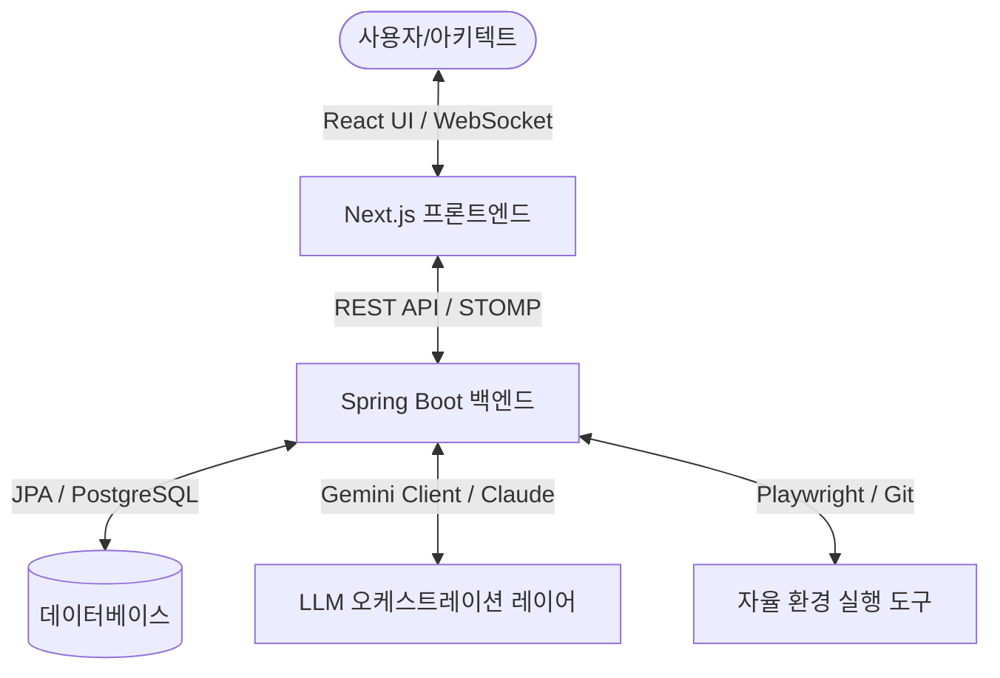

# K-Zone AI 군집 지능 워크스테이션 아키텍처 가이드 (ARCHITECTURE.md)

본 문서는 **K-Zone AI 군집 지능 워크스테이션(Swarm Intelligence Workstation)**의 핵심 아키텍처 설계와 구현 표준을 정의하는 통합 개발 가이드라인입니다. 본 시스템은 다중 인공지능 개체들이 협업하고 학습하여 복잡한 개발 태스크를 자율 수행하는 비즈니스 플랫폼입니다.

---

## 1. 핵심 철학 및 비게임성(Non-Gaming) 표준 원칙

본 플랫폼은 단순한 놀이나 게임 형식의 에이전트 연출을 철저히 배제하고, 엔터프라이즈급 소프트웨어 공학 도메인에 부합하는 정량적 분석 및 통계 지표를 제공합니다.

*   **성공 기여도 지표 (`contributionPoints`)**
    *   기존의 게임 스타일 '경험치/포인트' 개념을 혁신하여, 에이전트가 완수한 태스크의 가치, 자율 오류 해결 능력, 타 에이전트와의 협업 강도를 수식적으로 반영한 누적 비즈니스 기여도 지수입니다.
*   **인지 신뢰도 지수 (`reliabilityIndex`)**
    *   에이전트의 단순 '경험 레벨'을 대체합니다. 추론의 정확성, 코드 리뷰 정합성, 자가 복구 성공률을 통계적으로 계산한 백분율(%) 지표입니다.
*   **생산성 컴퓨팅 자산 배치 (`Asset Allocation`)**
    *   게임성 '아이템 상점' 및 '장비 구매' 개념을 **배제**합니다. 에이전트의 누적 기여도 지표를 자원으로 삼아, 고성능 추론 코어, 컨텍스트 윈도우 확장, 실시간 벡터 검색 엔진 등 최적의 하드웨어/소프트웨어 자원을 에이전트에 **배치 및 할당(Asset Allocation)**하는 엔지니어링 패러다임을 따릅니다.

---

## 2. 시스템 아키텍처 개요

본 워크스테이션은 전형적인 **Spring Boot 4.x 백엔드**와 **Next.js 16.x 프론트엔드**의 분산 웹 아키텍처로 설계되었습니다.



### 2.1. 백엔드 핵심 도메인 (`backend/`)
*   **`com.kzoneworkspace.backend.agent`**: 에이전트의 상태, 기여도, 성향 스냅샷, 신경 공명 로그를 처리하는 군집 지능 제어 본부입니다.
*   **`com.kzoneworkspace.backend.claude`**: LLM(Gemini 2.0 Flash 및 Claude) API 호출 인터페이스 및 추론 컨텍스트 주입 로직을 캡슐화합니다.
*   **`com.kzoneworkspace.backend.websocket`**: 프론트엔드로 실시간 에이전트 사고 흐름(Thought Process), 대화 메시지, 시스템 모니터링 로그를 발행하는 WebSocket(STOMP) 채널입니다.

### 2.2. 프론트엔드 지휘 통제실 (`frontend/`)
*   **실시간 다차원 시각화**: `Recharts`와 `Framer Motion`을 활용해 군집 지능의 역동적인 상호작용 및 파이프라인 정체 현상을 실시간 모니터링합니다.
*   **비즈니스 지향 대시보드**:
    *   `AgentEvolutionDashboard`: 개별 에이전트의 인지 성향 분포 및 신뢰도 곡선 분석.
    *   `WorkflowPipelineDashboard`: 실시간 업무 병목 진단 및 자동 최적화 전략 적용.
    *   `AssetAllocationDashboard` (신규): 성공 기여도를 활용한 에이전트별 성능 자산 할당 및 스케일 아웃 제어.

---

## 3. 개발 및 마이그레이션 가이드라인

1.  **한국어 및 전문 용어 준수**
    *   사용자 및 분석가용 UI 컴포넌트, 로그 메시지, 보고서 문서는 전원 한국어로 작성합니다.
    *   데이터베이스 하위 호환성을 위해 기존 JPA 매핑 필드(물리 컬럼명 `points`, `experience_level`)는 그대로 유지하되, 자바/코틀린 코드 상의 변수명은 각각 `contributionPoints`와 `reliabilityIndex`로 완전히 개편된 상태를 유지해야 합니다.
2.  **비동기 논블로킹 패러다임**
    *   LLM 또는 파일 시스템 I/O를 사용하는 모든 비즈니스 로직은 Kotlin Coroutines(`suspend`) 또는 Spring 비동기 이벤트를 통해 클라이언트 응답 대기 시간을 단축해야 합니다.
3.  **실시간 웹소켓 연동**
    *   에이전트 인지 데이터 변경(예: 자산 할당 완료, 파이프라인 최적화 성공 등)이 발생할 경우, 반드시 WebSocket 채널을 통해 변경 이벤트를 즉각 브로드캐스트하여 프론트엔드가 실시간 갱신되도록 합니다.
4.  **한글 기반 Conventional Commits 표준 규격 준수 (Commit Message Convention)**
    *   글로벌 도구 체인과의 호환성과 프로젝트 가독성을 모두 확보하기 위해, 본 프로젝트의 모든 커밋 메시지는 **한글 기반 Conventional Commits 규격**을 철저히 준수합니다.
    *   **구조 (Structure)**:
        ```text
        <type>(<scope>): <한글 제목>

        <한글 본문 기술>

        <footer>
        ```
    *   **허용 태그 (Allowed Types - 영문 소문자 고정)**:
        *   `feat`: 신규 비즈니스 기능 개발 (예: `feat(office): ...`)
        *   `fix`: 버그 및 예외 처리 수정
        *   `docs`: 프로젝트 문서 변경
        *   `style`: 세미콜론, 줄바꿈 등 포맷팅 수정 (코드 로직 변경 없음)
        *   `refactor`: 비즈니스 로직에 변화가 없는 프로덕션 코드 구조 개선
        *   `perf`: 연산 속도 향상 및 하드웨어 자산 배치 최적화
        *   `test`: 검증용 테스트 코드 추가 및 보강
        *   `chore`: 빌드, 의존성 패키지 관리 등 유틸리티성 잡무
    *   **규칙 (Rules)**:
        *   접두사 태그(`<type>(<scope>): `)는 시맨틱 도구 호환성을 위해 **영문 소문자**로 기입하되, 이어지는 제목은 **한국어**로 작성하며 끝에 마침표(`.`)를 찍지 않습니다.
        *   제목과 본문(Body) 사이에는 필히 하나의 빈 줄을 둡니다.
        *   본문은 "어떻게 구현했는지"보다 **"무엇을", "왜" 수정했는지**에 대한 엔지니어링 맥락과 기여 효과를 한국어로 상세하고 명확하게 기술합니다.
        *   **주관적 수식어 및 미사여구 배제**: "사용자의 제어력과 자율 미션 대응 성능을 높이기 위한 기능을 연계 구현했습니다" 또는 "~가 잘 동작하도록 수정했습니다"와 같은 모호하고 주관적인 미사여구, 불필요한 요약형 도입부는 철저히 배제합니다. 본문에는 오직 실제 변경된 기술적 사실과 엔지니어링 팩트만 단도직입적으로 나열하십시오.


